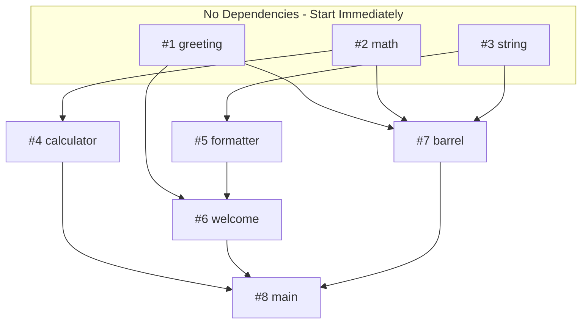

# Millhouse Test Repository

This repository contains test issues for testing [Millhouse](https://github.com/dave/millhouse), a tool that orchestrates parallel Claude Code instances to implement GitHub issues.

## Test Issues

| Issue | Title | Dependencies | Creates |
|-------|-------|--------------|---------|
| #1 | Add a greeting utility function | None | `src/utils/greeting.ts` |
| #2 | Add a math utility module | None | `src/utils/math.ts` |
| #3 | Add a string utility module | None | `src/utils/string.ts` |
| #4 | Create a calculator class | #2 | `src/calculator.ts` |
| #5 | Create a formatter module | #3 | `src/formatter.ts` |
| #6 | Create a welcome message generator | #1, #5 | `src/welcome.ts` |
| #7 | Create barrel export for utils | #1, #2, #3 | `src/utils/index.ts` |
| #8 | Create main entry point | #4, #6, #7 | `src/index.ts` |

## Dependency Graph



**Key points:**
- **#1, #2, #3** have no dependencies → start immediately in parallel
- **#4** starts when #2 finishes (doesn't wait for #1 or #3)
- **#5** starts when #3 finishes
- **#7** starts when #1, #2, AND #3 all finish
- **#6** starts when #1 AND #5 finish
- **#8** starts when #4, #6, AND #7 all finish

## Execution Example

With concurrency of 3, here's one possible execution:

| Time | Event | Running | Blocked |
|------|-------|---------|---------|
| T0 | Start | #1, #2, #3 | #4, #5, #6, #7, #8 |
| T1 | #2 completes | #1, #3, **#4** | #5, #6, #7, #8 |
| T2 | #3 completes | #1, #4, **#5** | #6, #7, #8 |
| T3 | #1 completes | #4, #5, **#7** | #6, #8 |
| T4 | #5 completes | #4, #7, **#6** | #8 |
| T5 | #4, #7 complete | #6 | #8 |
| T6 | #6 completes | **#8** | - |
| T7 | #8 completes | Done | - |

Note: Actual order varies based on which issues finish first.

## Running the Test

```bash
# Clone this repo
git clone https://github.com/dave/millhouse-test
cd millhouse-test

# Run millhouse starting from issue #8
millhouse run --issue 8

# Or dry-run to see the plan without executing
millhouse run --issue 8 --dry-run
```

## Expected Result

After a successful run, the repository should have:

```
src/
├── utils/
│   ├── greeting.ts    # from #1
│   ├── math.ts        # from #2
│   ├── string.ts      # from #3
│   └── index.ts       # from #7
├── calculator.ts      # from #4
├── formatter.ts       # from #5
├── welcome.ts         # from #6
└── index.ts           # from #8
```
